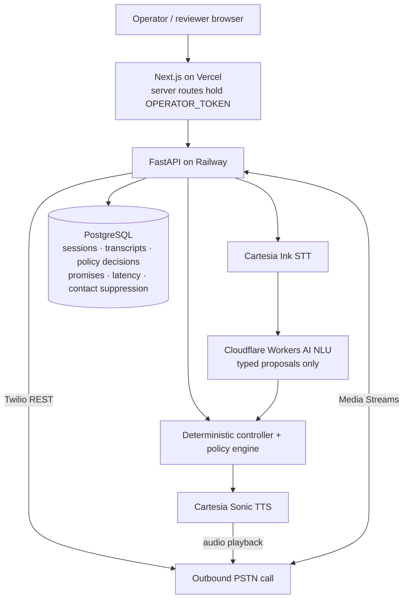

# AI Voice Collections Agent

A real-time AI voice collections POC that places live PSTN calls, verifies identity, negotiates repayment
within deterministic policy constraints, handles interruptions, and produces a full audit trail.

**Live demo:** https://ai-voice-calling-collections-agent.vercel.app ·
**Telephony (Start Call):** https://ai-voice-calling-collections-agent.vercel.app/telephony ·
**Sessions & audit:** https://ai-voice-calling-collections-agent.vercel.app/sessions ·
**Backend health:** https://ai-voice-calling-collections-agent-production.up.railway.app/ready

> **Portfolio proof-of-concept.** Synthetic identities and synthetic accounts only. The policy rules are
> *simulated demo rules inspired by regulated collections workflows*. They are not a statement of Japanese
> law, have not been reviewed by counsel and are not certified. Do not use this system to contact real
> debtors.

## Why I built this

- To practise production-style, real-time voice-agent engineering end to end: telephony, streaming speech,
  turn-taking, interruption, state control, observability and evaluation.
- Collections is a good stress test: identity must come before disclosure, payment terms have hard limits,
  a "yes" has to mean consent, and a stop-contact request must actually stop contact.
- The architecture deliberately separates **probabilistic language understanding** from **deterministic
  business authority**.

## Core capabilities

**Live on the deployed stack** (Vercel + Railway, real providers):

| Capability | Where |
|---|---|
| Outbound PSTN calls via Twilio REST, started from the web console | `app/api/telephony.py`, `/telephony` |
| Twilio Media Streams (μ-law 8 kHz ↔ PCM16 16 kHz), signed webhooks, per-call media-stream token | `app/api/telephony.py` |
| Cartesia Ink (`ink-whisper`) streaming STT and Sonic (`sonic-3`) streaming TTS, cancelled on barge-in | `app/providers/cartesia.py` |
| Cloudflare Workers AI (`llama-3.3-70b`) JSON-mode NLU, with a deterministic rules parser as fallback and safety net | `app/domain/understanding.py` |
| Deterministic conversation controller: the only writer of state | `app/domain/controller.py` |
| Identity-before-disclosure (name, then date of birth), including **partial DOB** handling | `controller.py`, `nlu_rules.py` |
| Payment-proposal validation (minimum, ≤ balance, date window, no discounts) | `app/domain/policy.py` |
| Promise-to-pay only after an explicit "yes" to a read-back that was actually played | `controller.py` |
| Stop-contact persisted per debtor **and** per contact point; later calls blocked before dialling | `policy.py`, `repository.py` |
| Barge-in: generation invalidation, TTS cancel, transport clear, measured cancel path | `app/voice/session.py` |
| English and Japanese (templates, number/date/era parsing, provider language params) | throughout |
| Audit trail: every policy decision, identity step, barge-in, lifecycle transition | `/sessions` |
| Per-turn latency breakdown (STT final, end-of-turn, NLU, policy, TTS first audio) | `app/voice/latency.py` |
| Browser voice demo (mic via AudioWorklet, or typed input) on the same runtime | `/demo` |

**Simulated / demo-only:**

- **Data and policy:** seven synthetic debtors/accounts (A–G) and simulated demo rules (calling window,
  attempt limit, identity attempts).
- **Human transfer:** the transfer state is implemented. A live transfer requires `TWILIO_TRANSFER_NUMBER`;
  without it the transfer is recorded as `SIMULATED`, and the public demo may use simulated transfer.
- **SMS/e-mail promise confirmation:** goes to a mock outbox behind the `Notifier` interface.
- **Evaluation suite (32 scenarios):** runs on mock providers and a virtual clock. The LLM-as-judge is
  optional and has not been run with credentials.

## Architecture



One caller turn: audio → VAD + streaming STT → end-of-turn → LLM interpretation into a typed proposal
(no side effects) → `ConversationController.apply()` runs the policy checks and changes state →
template (or guarded LLM rephrase) → streaming TTS. Details: [docs/ARCHITECTURE.md](docs/ARCHITECTURE.md) ·
[docs/VOICE_RUNTIME.md](docs/VOICE_RUNTIME.md) · [docs/POLICY_ENGINE.md](docs/POLICY_ENGINE.md).

## Design principle: the language model handles language; the application owns authority

- **The LLM interprets.** It returns typed actions (`PROPOSE_PAYMENT`, `PROVIDE_DOB`, `PARTIAL_DOB`,
  `STOP_CONTACT`, …) validated by a strict schema (`app/domain/commands.py`). No action can set identity,
  disclosure, promise or transfer state.
- **The controller decides what is valid now.** Each phase has an allowed-action contract
  (`app/domain/turn_context.py`). While a date of birth is expected, a payment proposal is dropped and
  audited as `nlu.action_out_of_phase`.
- **The policy layer decides what is allowed.** Every check is a `PolicyDecision` in the audit log:
  `IDENTITY_REQUIRED_BEFORE_DISCLOSURE`, `PAYMENT_DATE_WITHIN_MAX_EXTENSION`, `STOP_CONTACT_BLOCKS_CONTACT`, …
- **So the LLM cannot:**
  - disclose the balance before verification (the output guard also blocks numbers and debt words);
  - accept a 60-day extension when policy allows 14;
  - confirm a promise without a heard read-back;
  - skip a stop-contact request (the rules parser detects caller-rights intents independently);
  - start a transfer on its own.
- **Guarded rephrasing.** Replies come from templates by default. An optional LLM rephrasing may not
  introduce any number that is absent from the approved template.

## Engineering findings from real PSTN tests

**A. Partial date of birth.** On a real call the caller said "Whatever. April. 1988".
- The LLM returned `dob="1988-04"` and schema validation rejected it.
- The unconstrained fallback parser then read "1988" as a ¥1,988 payment proposal.
- On another turn the LLM padded "you 1988." to 1988-01-01, which cost the caller a verification attempt.
- Fixes:
  - phase-aware allowed-action contract;
  - an explicit `PARTIAL_DOB` action (year/month/day, never padded);
  - DOB parts must be supported by the transcript;
  - the fallback parser is constrained to the expected slot;
  - the agent asks only for the missing part ("And what day in April?").

**B. Stop-contact scope.** A stop-contact request on Scenario E did not block a later Scenario A call to the
same number. The flag lived on one synthetic account, and every scenario is a different synthetic debtor.
- The request now applies to the debtor (all accounts) and to the **contact point** (the dialled number).
- The number is stored only as a salted hash plus a masked label.
- The call is blocked before a Twilio call is created.

**C. Voice latency is not consistently under 1.5 s.**
- On the first PSTN call (7 voice turns, before the fixes above), speech end → first agent audio was
  **1.47–1.97 s** (median 1.81 s).
- Stage timings on that call:

  | Stage | Time |
  |---|---|
  | STT final transcript | ≈320 ms |
  | End-of-turn commit | ≈290–310 ms (one turn 868 ms) |
  | Cloudflare NLU | **746–1,262 ms** |
  | Cartesia first audio | 100–178 ms |

- The LLM call is the largest and most variable stage; mitigations are listed in
  [VOICE_RUNTIME.md](docs/VOICE_RUNTIME.md#latency-budget).

## Verified end-to-end flows

| Flow | Evidence |
|---|---|
| Real PSTN call: name confirmed → partial DOB → DOB verified → disclosure; barge-in events in the audit trail | Session `2fa211b9` (2026-09-26); the regression is replayed by eval cases `pstn_partial_dob*` |
| Browser and PSTN session audit views (transcript, identity, policy, barge-in, latency) | `/sessions`; tests in `frontend/tests/sessions-page.test.tsx` |
| Stop-contact on a PSTN call (Scenario E): `stop_contact=true`, `ended_reason=stop_contact_requested` | Owner-reported test, 2026-09-26 |
| Later call to the same number blocked before dialling (any scenario) | End-to-end tests with a fake Twilio (`tests/test_stop_contact_scope.py`); live re-test pending the debtor/contact-point fix deploy |
| Promise-to-pay and human transfer | Covered by the browser runtime and the evaluation suite; on PSTN, owner-reported only (no session id recorded here) |

Automated: backend 227 tests (PostgreSQL + SQLite), frontend 100 tests, evaluation 32/32 (mock providers).

## Demo scenarios

| Scenario | Behaviour under test | Key invariant |
|---|---|---|
| A Cooperative payer | Successful promise-to-pay (¥30,000) | Amount and date stay inside the approved envelope |
| B Cannot pay in full | Negotiation within limits | Nothing below the minimum or beyond the window is accepted |
| C Extension beyond policy | 60-day request vs 14-day limit | The promise is never confirmed |
| D Wrong party | Identity / privacy | No debt disclosure |
| E Stop contact | Contact suppression | Future calls to that debtor and number are blocked |
| F Barge-in | Voice runtime | Playback is cancelled; the new turn is handled |
| G Human transfer | Escalation | Deterministic transfer state (simulated without a transfer number) |

Synthetic identities and DOBs are shown on each scenario card. Walkthrough:
[docs/DEMO_SCRIPT.md](docs/DEMO_SCRIPT.md).

## Security and privacy

- **`OPERATOR_TOKEN` is server-only.**
  - Two Next.js route handlers add it for phone-session detail and Start Call.
  - The browser never sends, receives or stores it.
  - A CI step builds with a canary token and scans the client bundle.
- **Railway stays authenticated.** `/api/operator/calls` and phone-session detail reject requests without
  the bearer token.
- **Start Call guards:**
  - same-origin JSON only;
  - fields validated (E.164, scenario, language);
  - duplicate-call and rate guards;
  - the backend's allowlist (`DEMO_CALL_ALLOWED_NUMBERS`), hourly limit and contact policy decide.
- **Twilio:** webhook signatures are validated; the media WebSocket requires a per-call HMAC token;
  telephony routes return 404 unless telephony is configured.
- **Contact numbers** where someone asked to stop are stored as a SHA-256 key with a fixed application salt
  plus a masked label (`+81•••••••678`), not in clear. This is pseudonymisation, not strong protection:
  phone numbers are guessable.
- **Data:** synthetic only. Transcript text expires after `TRANSCRIPT_RETENTION_DAYS` (default 30); raw
  audio is never stored. JSON logs redact token-like values.
- **POC access model:** the public console has no login, so anyone with the URL can view audit detail and
  call allowlisted numbers. A production deployment needs real access control, for example SSO or Vercel
  Deployment Protection (see DECISIONS.md D14).

## Known limitations

- Simulated demo policy, not Japanese legal compliance. No claim of production collections readiness.
- Human transfer is simulated unless `TWILIO_TRANSFER_NUMBER` is configured.
- Latency is not consistently below 1.5 s. The measurements are a handful of live turns, not a benchmark.
- Model and provider choices are tuned for POC cost and speed.
- Voice activity detection is a simple energy VAD. Background noise in the browser can trigger or delay
  barge-in and turn-taking; headphones help.
- Demo rate limits and the allowlist are intentionally restrictive; the in-process session state requires a
  single replica.
- Japanese has not been reviewed by a native speaker. No post-training has been done
  ([plan](docs/POST_TRAINING_PLAN.md)).

## Measured latency (detail)

| Measurement | Result | Conditions |
|---|---|---|
| PSTN voice turns, speech end → first agent audio | 1.47–1.97 s (median 1.81 s), n=7 | Real call `2fa211b9`, Twilio + Cartesia + Cloudflare, 2026-09-26 |
| Live browser voice turn, speech end → first audio | ≈1.43 s, n=1 | Deployed backend; the agent's own TTS audio was replayed as the caller |
| Live TTS time-to-first-audio | 96–140 ms warm, 410 ms cold | n=4, deployed backend |
| Barge-in cancel path (detect → TTS stopped), in-process | p50 0.27 ms, p95 0.50 ms, n=50 | Mock TTS; excludes network and client buffer flush |
| Typed turn → first audio frame | 2–8 ms | Mock providers; pipeline overhead only |

`/api/metrics/latency` and the session pages report p50/p95 per provider mode from real sessions.

## Run locally

Requirements: Python 3.12+, Node 22+. No API keys and no database server are needed (SQLite and mock
providers).

```bash
cd backend && python3.12 -m venv .venv && . .venv/bin/activate && pip install -e ".[dev]"
uvicorn app.main:_app_factory --factory --reload --port 8000

cd frontend && npm ci
NEXT_PUBLIC_API_BASE_URL=http://localhost:8000 npm run dev   # http://localhost:3000
```

Full stack with PostgreSQL: `docker compose up --build`.

Checks:

- **Backend:** `ruff check app tests alembic && mypy app && pytest -q && python -m app.evaluation`
- **Frontend:** `npm run lint && npm run typecheck && npm test && npm run check:bundle`

## Deployment configuration

Every variable is documented in [.env.example](.env.example); step-by-step in
[docs/DEPLOYMENT.md](docs/DEPLOYMENT.md) and [docs/TELEPHONY.md](docs/TELEPHONY.md).

**Backend (Railway)**

- `APP_ENV=production`, `DATABASE_URL`, and `FRONTEND_URL` set to the exact Vercel origin.
- Providers:
  - `LLM_PROVIDER=cloudflare` with `CLOUDFLARE_ACCOUNT_ID` and `CLOUDFLARE_API_TOKEN`;
  - `STT_PROVIDER=cartesia` and `TTS_PROVIDER=cartesia` with `CARTESIA_API_KEY`, `CARTESIA_VOICE_ID` and
    `CARTESIA_VOICE_ID_JA`.
- Telephony: `TELEPHONY_ENABLED=true`, `TWILIO_ACCOUNT_SID`, `TWILIO_AUTH_TOKEN`, `TWILIO_PHONE_NUMBER`,
  `TWILIO_WEBHOOK_BASE_URL`, `DEMO_CALL_ALLOWED_NUMBERS`, `OPERATOR_TOKEN`, and optionally
  `TWILIO_TRANSFER_NUMBER`.
- Policy: `POLICY_COUNTRY`, `POLICY_TIMEZONE`, `POLICY_CALLING_START_HOUR`, `POLICY_CALLING_END_HOUR`.

**Frontend (Vercel)**

- `NEXT_PUBLIC_API_BASE_URL` (public; the backend URL).
- `OPERATOR_TOKEN` (server-only; same value as Railway, never `NEXT_PUBLIC_`).
- Optionally `BACKEND_API_BASE_URL`.

**Twilio**

- `TWILIO_WEBHOOK_BASE_URL` must equal the public backend URL exactly, because signatures depend on it.
- Outbound calls get their voice and status callbacks automatically.
- For inbound calls, point the number's Voice webhook to `POST {base}/telephony/twilio/voice`.
- Trial accounts can only call verified numbers.

## Project structure

```
backend/app/domain/       controller, policy, allowed-action contract, typed commands, rules NLU, responses + guard
backend/app/voice/        session runtime, VAD, end-of-turn, lifecycle, latency
backend/app/providers/    interfaces, mocks, Cloudflare, Cartesia, Twilio
backend/app/api/          REST, browser WebSocket, Twilio webhooks + media stream
backend/app/persistence/  schema, repository, DB recorder        backend/alembic/  migrations
backend/app/evaluation/   32 scenario cases, runner, judges
frontend/                 Next.js console: /demo, /telephony, /sessions, /evaluation, /architecture
docs/                     architecture, voice runtime, policy, evaluation, telephony, deployment, decisions
```

**Not built (production evolution):**

- model-based VAD and turn detection;
- streaming LLM → sentence-level TTS;
- a live benchmark with p95 targets;
- Redis-backed sessions for multiple replicas;
- warm human hand-off;
- real SMS/e-mail providers;
- counsel-reviewed consent and recording disclosures;
- native-speaker review;
- post-training ([plan](docs/POST_TRAINING_PLAN.md)).

Design decisions and trade-offs: [docs/DECISIONS.md](docs/DECISIONS.md).
